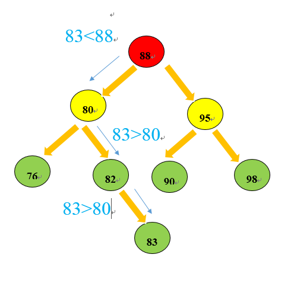

### Binary Tree  

1. 二叉树的优势
    在实际使用时会根据**链表**和**有序数组**等数据结构的不同优势进行选择。
    有序数组的优势在于二分查找，链表的优势在于数据项的插入和数据项的删除。
    但是在有序数组中插入数据就会很慢，同样在链表中查找数据项效率就很低。
    综合以上情况，二叉树可以利用链表和有序数组的优势，同时可以合并有序数组和链表的优势，二叉树也是一种常用的数据结构。

2. 二叉树的构成
    节点（node）和边组成。节点分为根节点、父节点、子节点
    通常来说树是顶部小，底部大，且树呈分层结构。root节点时第0层，以此类推。**二叉树最多有两个节点**

3. 二叉树搜索
    二叉树一个节点左子节点的关键字小于这个节点，右子节点关键字大于或等于这个父节点。
    ```
    //创建一个树的节点
    //每个node存放两个数据
    //一个左node引用和一个右node引用
    class Node
    {
        public  int iData;
        public double dData;
        public Node leftNode;
        public Node rightNode;
        //显示树节点信息
        public void showNode()
        {
            System.out.println("{ "+iData+","+dData+" }");
        }
    }
    ```

4. 创建一个树结构
    创建一个树结构首先是向一个树种插入数据节点。当一棵树为null时，数据项是从树的root节点处开始插入，
    之后的插入顺序是根据搜索节点顺序规则进行插入。具体规则是：如果数据项比父节点的数据项要小，则插在父节点的左节点（leftNode），
    如果比父节点的数据项要大，则将新的node插入在父节点的右节点处（rightNode）。
    在插入节点的过程中其实也就是对tree遍历的过程，最终根据条件遍历到左右节点为null时进行添加新的节点。
    

5. 查找关键字  
    查找关键字是数据结构一项重要操作项，在有序数组中通过二分排序效率非常高。在二叉树中的查找效率也比较高。
    因为二叉树的添加node的过程就是根据数据项的大小进行有序添加的，并不是毫无秩序的插入数据项。
    在有序的基础上进行查找关键字效率就会快很多。
    ```
    //在tree中寻找关键字
        //返回一个Node
        //显示这个Node
        public Node find(int key)
        {
            Node current=root;
            while(current.iData!=key)
            {
                if(current.iData>key)
                {
                    current=current.leftNode;
                }else
                {
                    current=current.rightNode;
                }
                if(current==null)
                    return null;
            }
            return current;
        }
    ```

6. 树的最值查找  
    树的最值查找在树中查找是比较容易的，因为从root开始查找，最小值只会出现所有父节点的左节点处，
    同样最大值只会出现在所有父节点的沿着右节点搜索的最底层右节点处。
    ```
    //查找树中的最大值和最小值 
        //最小值存在于一棵树的最下层的最左node
        //最大值存在于一棵树的最下层的最右node
        public Node[] mVal()
        {
            Node minNode=null;
            Node maxNode=null;
            Node[] maxminVal=new Node[2];
            Node current=root;//从树的顶部开始搜索
            while(current!=null)
            {
                minNode=current;
                current=current.leftNode;   
            }
            maxminVal[0]=minNode;
            current=root;
            while(current!=null)
            {
                maxNode=current;
                current=current.rightNode;
            }
            maxminVal[1]=maxNode;
            return maxminVal;
        }
    ```
    由于第一个插入节点就是在root节点处进行插入，不管其数据项大小，该节点都是root节点，处于树的最顶层。
    
### complete binary tree

1. 定义  
    - 若设二叉树的深度为h，除第 h 层外，其它各层 (1～h-1) 的结点数都达到最大个数，第 h 层所有的结点都连续集中在最左边，
    这就是完全二叉树。
    - 完全二叉树是由满二叉树而引出来的。对于深度为K的，有n个结点的二叉树，
    当且仅当其每一个结点都与深度为K的满二叉树中编号从1至n的结点一一对应时称之为完全二叉树。
    - 一棵二叉树至多只有最下面的一层上的结点的度数可以小于2，并且最下层上的结点都集中在该层最左边的若干位置上，
    而在最后一层上，右边的若干结点缺失的二叉树，则此二叉树成为完全二叉树。
    - 叶子结点只可能在最大的两层上出现,对任意结点，若其右分支下的子孙最大层次为L，则其左分支下的子孙的最大层次必为L 或 L+1
    - 满二叉树一定是完全二叉树，完全二叉树不一定是满二叉树。
2. 通常采用数组的方式储存

### Balanced Binary Tree

1. 定义
    平衡二叉树（Balanced Binary Tree）是二叉查找树的一个进化体，也是第一个引入平衡概念的二叉树。AVL树
    平衡二叉树要求对于每一个节点来说，它的左右子树的高度之差不能超过1，如果插入或者删除一个节点使得高度之差大于1，
    就要进行节点之间的旋转，将二叉树重新维持在一个平衡状态。这个方案很好的解决了二叉查找树退化成链表的问题，
    把插入，查找，删除的时间复杂度最好情况和最坏情况都维持在O(logN)。但是频繁旋转会使插入和删除牺牲掉O(logN)左右的时间，
    不过相对二叉查找树来说，时间上稳定了很多。
    
- **平衡二叉树是一种二叉排序树**，是一种高度平衡的二叉树，其中每个结点的左子树和右子树的高度至多等于1.
意味着：要么是一棵空树，要么左右都是平衡二叉树，且左子树和右子树深度之绝对值不超过1. 
将二叉树上结点的左子树深度减去右子树深度的值称为平衡因子BF，那么平衡二叉树上的所有结点的平衡因子只可能是-1、0和1。
只要二叉树上有一个结点的平衡因子的绝对值大于1，则该二叉树就是不平衡的。

- 
    

