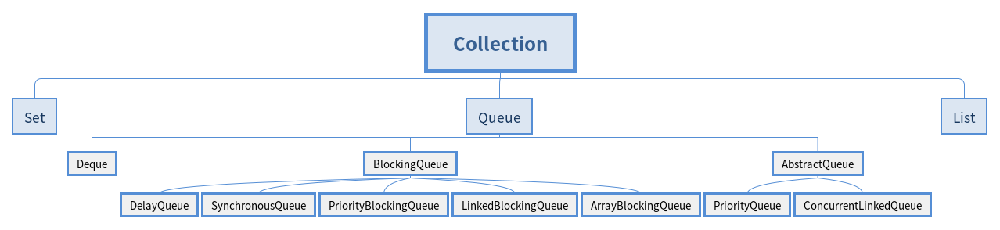

### Key word
**FIFO**

  

1. 没有实现的阻塞接口的(extends AbstractQueue<E> implements Queue<E>)
    1. PriorityQueue  
        1. 有序列表（底层数组实现）
        1. 加入的元素天然排序
        1. 或根据传递给构造函数的 java.util.Comparator 实现来定位。
    2. ConcurrentLinkedQueue  
        1. 基于链接节点（底层链表实现）
        1. 线程安全
        1. 并发访问不需要同步(队列的尾部添加元素并从头部删除它们)
        1. 对公共集合的共享访问友好
        1. 慎用size(需要遍历队列)
2. 实现阻塞接口的(extends AbstractQueue<E> implements BlockingQueue<E>)
    1. ArrayBlockingQueue   一个由数组支持的有界队列
        1. 在构造时需要指定容量
        1. 可以选择是否需要公平性，如果公平参数被设置true，等待时间最长的线程会优先得到处理
        （其实就是通过将ReentrantLock设置为true来 达到这种公平性的：即等待时间最长的线程会先操作）。
        通常，公平性会使你在性能上付出代价，只有在的确非常需要的时候再使用它。
        1. 基于数组的阻塞循环队列，此队列按 FIFO（先进先出）原则对元素进行排序。
    1. LinkedBlockingQueue 一个由链接节点支持的可选有界队列
        1. 在不指定时容量为Integer.MAX_VALUE，
        1. 它是基于链表的队列，此队列按 FIFO（先进先出）排序元素。
    1. PriorityBlockingQueue 一个由优先级堆支持的无界优先级队列
        1. 是一个带优先级的队列，而不是先进先出队列。
        1. 元素按优先级顺序被移除，该队列也没有上限
        （PriorityBlockingQueue是对 PriorityQueue的再次包装，???是基于堆数据结构的，
        而PriorityQueue是没有容量限制的，与ArrayList一样，所以在优先阻塞 队列上put时是不会受阻的。
        虽然此队列逻辑上是无界的，但是由于资源被耗尽，所以试图执行添加操作可能会导致 OutOfMemoryError）
        1. 如果队列为空，那么取元素的操作take就会阻塞，所以它的检索操作take是受阻的。
        1. 往入该队列中的元素要具有比较能力。
    1. DelayQueue   一个由优先级堆支持的、基于时间的调度队列
        1. （基于PriorityQueue来实现的）是一个存放Delayed元素的无界阻塞队列
        1. 只有在延迟期满时才能从中提取元素。该队列的头部是延迟期满后保存时间最长的 Delayed 元素。
        1. 如果延迟都还没有期满，则队列没有头部，并且poll将返回null。
        1. 当一个元素的 getDelay(TimeUnit.NANOSECONDS) 方法返回一个小于或等于零的值时，则出现期满，poll就以移除这个元素了。
        1. 此队列不允许使用 null 元素。
    1. SynchronousQueue 一个利用 BlockingQueue 接口的简单聚集（rendezvous）机制
      
    | 操作 | 描述 | note |
    |:---|:---|:---|
    | add    |    增加一个元索           |          如果队列已满，则抛出一个IllegalStateException异常|
    | remove  | 移除并返回队列头部的元素  |  如果队列为空，则抛出一个NoSuchElementException异常|
    | element | 返回队列头部的元素      |       如果队列为空，则抛出一个NoSuchElementException异常|
    | offer   |    添加一个元素并返回true    |   如果队列已满，则返回false|
    | poll    |     移除并返问队列头部的元素  |  如果队列为空，则返回null|
    | peek    |   返回队列头部的元素        |     如果队列为空，则返回null|
    | put     |    添加一个元素            |          如果队列满，则阻塞|
    | take    |    移除并返回队列头部的元素  |   如果队列为空，则阻塞|
    | remainingCapacity | 返回理想剩余容量 | no intrinsic limit Integer.MAX_VALUE|
    | contains | 包含 | return bool |
    | drainTo | 移除队列中元素到collection中 | 返回转移数量 |  
    
    add remove 操作在你试图为一个已满的队列增加元素或从空队列取得元素时 抛出异常。  
    当然，在多线程程序中，队列在任何时间都可能变成满的或空的，所以你可能想使用offer、poll、peek方法。
    这些方法在无法完成任务时,只是给出一个return false 而不会抛出异常。  
    阻塞操作put和take。put方法在队列满时阻塞，take方法在队列空时阻塞。
